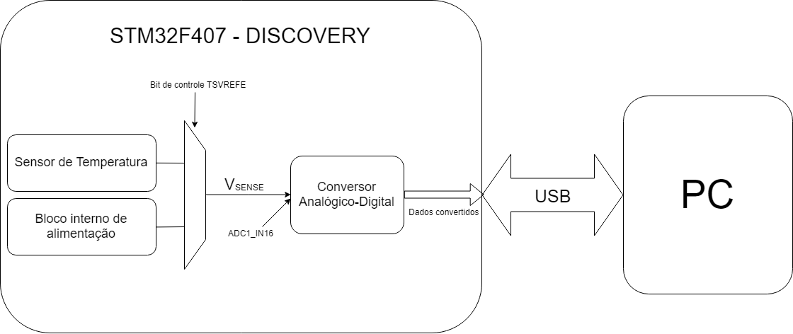

# Plot de temperatura

## Proposta
Este projeto tem como objetivo plotar, em tempo real, a temperatura interna da placa STM32F407 Discovery. Para isso, serão coletados os dados provindos do sensor interno de temperatura da placa, após terem sido convertidos pelo conversor analógico digital também da própria placa. Esses dados serão transmitidos via usb para um computador que, por meio do software LabView, fará a plotagem.
A motivação desse projeto é o monitoramento da temperatura da Discovery de forma a previnir algum tipo dano causado por um eventual superaquecimento, bem como tentar facilitar a inspeção da causa do superaquecimento visto que o processo será em tempo real.

## Periféricos
No projeto serão utilizados:

#### 1 STM32F407 Discovery
#### 1 PC - LabView

Figura 1: Diagrama de Blocos

## Pinagem
Conversor AD -> ADC_IN16

## Fluxoagrama

